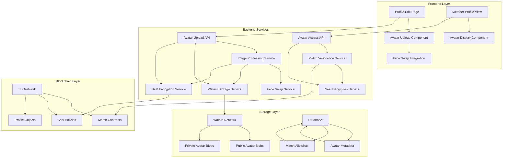
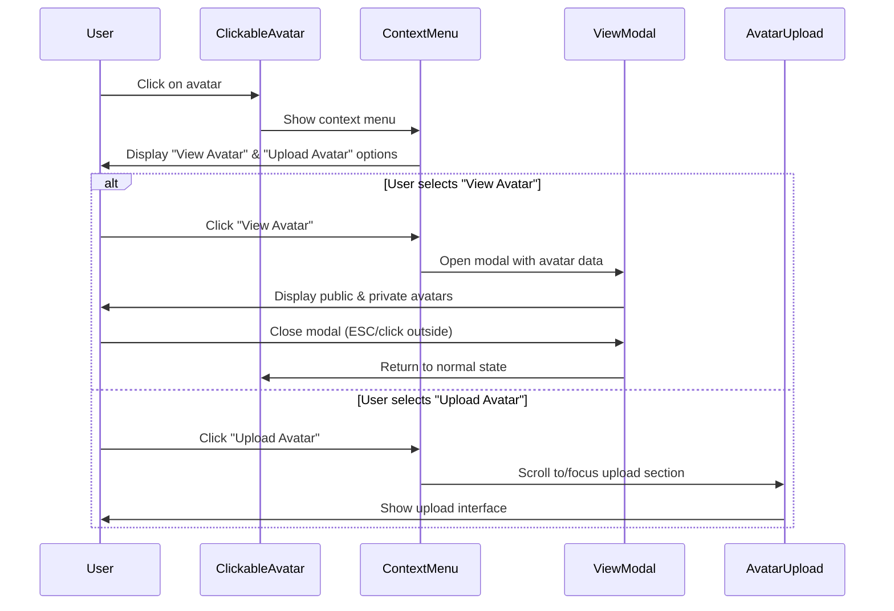

# Design Document

## Overview

The Seal Profile Avatar feature implements a privacy-enhanced avatar system that integrates with the existing matching platform. The system provides two-tier avatar visibility: public face-swapped avatars for non-matched users and private encrypted avatars for matched users. This design leverages the existing Walrus storage infrastructure, Seal Protocol encryption, and face-swap functionality to create a progressive disclosure system that encourages meaningful connections while protecting user privacy.

## Architecture

### High-Level Architecture



### Component Integration

The system integrates with existing components:

1. **Matching System**: Uses existing `Match` objects and `MatchAllowlist` from the Seal policies
2. **Face Swap Tool**: Leverages existing face-swap functionality from `/face-swap-tool`
3. **Walrus Storage**: Uses existing `WalrusStorageProvider` for decentralized storage
4. **Profile System**: Extends existing `UserProfile` contract and database schema
5. **Member Pages**: Integrates with existing `/members/edit` and `/members/[userId]` pages

### User Interaction Flow for Clickable Avatar



## Components and Interfaces

### 1. Avatar Upload Component

**Location**: `src/components/AvatarUpload.tsx`

**Purpose**: Handles avatar image upload with automatic face-swap generation

**Key Features**:
- Image upload with validation (format, size)
- Automatic face-swap generation using existing face-swap service
- Preview of both original and face-swapped versions
- Upload progress indication
- Error handling and retry mechanisms

**Props Interface**:
```typescript
interface AvatarUploadProps {
  currentAvatar?: {
    publicUrl?: string;
    privateUrl?: string;
  };
  onUploadComplete: (result: AvatarUploadResult) => void;
  onError: (error: string) => void;
  isLoading?: boolean;
}

interface AvatarUploadResult {
  publicAvatar: {
    walrusBlobId: string;
    url: string;
  };
  privateAvatar: {
    walrusBlobId: string;
    sealPolicyId: string;
    encryptedUrl: string;
  };
}
```

### 1.1. Clickable Avatar Component

**Location**: `src/components/ClickableAvatar.tsx`

**Purpose**: Provides interactive avatar display with context menu for view/upload actions

**Key Features**:
- Clickable avatar display that triggers action menu
- Context menu with "View Avatar" and "Upload Avatar" options
- Smooth animations and hover states
- Keyboard accessibility (Enter/Space to activate)
- Mobile-friendly touch interactions

**Props Interface**:
```typescript
interface ClickableAvatarProps {
  currentAvatar?: {
    publicUrl?: string;
    privateUrl?: string;
  };
  onViewAvatar: () => void;
  onUploadAvatar: () => void;
  size?: 'sm' | 'md' | 'lg' | 'xl';
  className?: string;
  showMenu?: boolean;
}
```

### 1.2. Avatar View Modal Component

**Location**: `src/components/AvatarViewModal.tsx`

**Purpose**: Full-screen modal for viewing both public and private avatar versions

**Key Features**:
- Side-by-side display of public and private avatars
- Clear labeling of avatar types and visibility
- Responsive design for mobile and desktop
- Keyboard navigation (ESC to close, arrow keys to navigate)
- Click outside to close functionality

**Props Interface**:
```typescript
interface AvatarViewModalProps {
  isOpen: boolean;
  onClose: () => void;
  publicAvatar?: string;
  privateAvatar?: string;
  userName?: string;
}
```

### 2. Avatar Display Component

**Location**: `src/components/AvatarDisplay.tsx`

**Purpose**: Displays appropriate avatar based on match status

**Key Features**:
- Automatic match status detection
- Graceful fallback to public avatar if decryption fails
- Loading states and error handling
- Placeholder avatar for users without uploads

**Props Interface**:
```typescript
interface AvatarDisplayProps {
  userId: string;
  currentUserId?: string;
  size?: 'sm' | 'md' | 'lg' | 'xl';
  className?: string;
  showFallback?: boolean;
}
```

### 3. Avatar Processing Service

**Location**: `src/services/avatarService.ts`

**Purpose**: Handles avatar upload, processing, and storage orchestration

**Key Methods**:
```typescript
interface AvatarService {
  uploadAvatar(file: File, userId: string): Promise<AvatarUploadResult>;
  getAvatarForUser(targetUserId: string, viewerUserId: string): Promise<AvatarResult>;
  updateAvatarPermissions(userId: string, matchId: string, action: 'grant' | 'revoke'): Promise<void>;
  deleteAvatar(userId: string): Promise<void>;
}
```

### 4. Face Swap Integration Service

**Location**: `src/services/faceSwapIntegration.ts`

**Purpose**: Integrates with existing face-swap functionality for public avatar generation

**Key Methods**:
```typescript
interface FaceSwapIntegrationService {
  generatePublicAvatar(originalImage: File): Promise<{
    swappedImage: Blob;
    randomFaceName: string;
  }>;
  validateImageForSwap(image: File): Promise<boolean>;
}
```

### 5. Seal Policy Manager

**Location**: `src/services/sealPolicyManager.ts`

**Purpose**: Manages Seal Protocol policies for avatar access control

**Key Methods**:
```typescript
interface SealPolicyManager {
  createAvatarPolicy(userId: string, initialMatches: string[]): Promise<string>;
  addMatchToPolicy(policyId: string, matchId: string): Promise<void>;
  removeMatchFromPolicy(policyId: string, matchId: string): Promise<void>;
  verifyAccess(policyId: string, viewerAddress: string): Promise<boolean>;
}
```

## Data Models

### Database Schema Extensions

**User Table Extension**:
```sql
ALTER TABLE "User" ADD COLUMN "publicAvatarBlobId" TEXT;
ALTER TABLE "User" ADD COLUMN "privateAvatarBlobId" TEXT;
ALTER TABLE "User" ADD COLUMN "avatarSealPolicyId" TEXT;
ALTER TABLE "User" ADD COLUMN "avatarUploadedAt" TIMESTAMP;
ALTER TABLE "User" ADD COLUMN "avatarSettings" JSONB DEFAULT '{}';
```

**Avatar Settings JSON Structure**:
```typescript
interface AvatarSettings {
  enabled: boolean;
  visibility: 'matches_only' | 'premium_matches' | 'all_matches';
  expiryDays?: number;
  allowDownload: boolean;
  moderationStatus: 'pending' | 'approved' | 'rejected';
}
```

### On-Chain Data Models

**Extended UserProfile Contract**:
```move
public struct UserProfile has key, store {
    // ... existing fields ...
    
    // Avatar fields
    public_avatar_blob_id: Option<String>,
    private_avatar_blob_id: Option<String>,
    avatar_seal_policy_id: Option<String>,
    avatar_settings: AvatarSettings,
}

public struct AvatarSettings has store, copy, drop {
    enabled: bool,
    visibility_level: u8,
    expires_at: Option<u64>,
    allow_download: bool,
}
```

**Avatar Access Events**:
```move
public struct AvatarAccessed has copy, drop {
    owner: address,
    viewer: address,
    avatar_type: u8, // 0 = public, 1 = private
    timestamp: u64,
}

public struct AvatarUploaded has copy, drop {
    owner: address,
    public_blob_id: String,
    private_blob_id: String,
    policy_id: String,
    timestamp: u64,
}
```

## Error Handling

### Error Categories

1. **Upload Errors**:
   - Invalid image format
   - File size too large
   - Face detection failure
   - Walrus storage failure
   - Seal encryption failure

2. **Access Errors**:
   - No match relationship
   - Expired access
   - Decryption failure
   - Policy not found

3. **Processing Errors**:
   - Face swap generation failure
   - Image processing timeout
   - Network connectivity issues

### Error Recovery Strategies

1. **Graceful Degradation**: Fall back to public avatar if private avatar fails
2. **Retry Logic**: Automatic retry for transient failures (network, storage)
3. **User Feedback**: Clear error messages with actionable suggestions
4. **Fallback Storage**: Use Cloudinary as backup if Walrus fails (hybrid mode)

### Error Response Format

```typescript
interface AvatarError {
  code: string;
  message: string;
  details?: Record<string, any>;
  retryable: boolean;
  fallbackAvailable: boolean;
}
```

## Testing Strategy

### Unit Tests

1. **Avatar Service Tests**:
   - Upload flow validation
   - Error handling scenarios
   - Permission management
   - File format validation

2. **Face Swap Integration Tests**:
   - Image processing pipeline
   - Random face selection
   - Error recovery

3. **Seal Policy Tests**:
   - Policy creation and management
   - Access verification
   - Match-based permissions

### Integration Tests

1. **End-to-End Avatar Flow**:
   - Complete upload and display cycle
   - Match-based access control
   - Cross-browser compatibility

2. **Storage Integration**:
   - Walrus upload/download
   - Seal encryption/decryption
   - Fallback mechanisms

3. **Performance Tests**:
   - Large image handling
   - Concurrent uploads
   - Cache effectiveness

### API Tests

1. **Avatar Upload API**:
   - Valid upload scenarios
   - Invalid input handling
   - Authentication/authorization
   - Rate limiting

2. **Avatar Access API**:
   - Match verification
   - Permission checks
   - Caching behavior

## Security Considerations

### Privacy Protection

1. **Encryption at Rest**: All private avatars encrypted with Seal Protocol
2. **Access Control**: Match-based allowlists enforce viewing permissions
3. **Metadata Protection**: No sensitive data in public avatar metadata
4. **Audit Trail**: All avatar access logged for security monitoring

### Content Moderation

1. **Automated Screening**: AI-based content analysis before upload
2. **Manual Review**: Flagged content reviewed by moderators
3. **User Reporting**: Report inappropriate avatars functionality
4. **Quick Removal**: Fast takedown process for policy violations

### Data Protection

1. **GDPR Compliance**: User data deletion includes avatar removal
2. **Consent Management**: Clear consent for avatar sharing
3. **Data Minimization**: Only store necessary avatar metadata
4. **Retention Policies**: Automatic cleanup of expired avatars

## Performance Optimizations

### Caching Strategy

1. **CDN Caching**: Public avatars cached at edge locations
2. **Browser Caching**: Appropriate cache headers for avatar images
3. **Memory Caching**: Frequently accessed avatars cached in memory
4. **Database Caching**: Avatar metadata cached with Redis

### Image Optimization

1. **Format Selection**: WebP for modern browsers, JPEG fallback
2. **Size Variants**: Multiple sizes generated for different use cases
3. **Compression**: Optimal compression without quality loss
4. **Lazy Loading**: Load avatars only when visible

### Network Optimization

1. **Parallel Processing**: Face swap and encryption in parallel
2. **Batch Operations**: Group multiple avatar operations
3. **Connection Pooling**: Reuse connections to Walrus endpoints
4. **Retry Logic**: Exponential backoff for failed requests

## Monitoring and Analytics

### Key Metrics

1. **Upload Success Rate**: Percentage of successful avatar uploads
2. **Access Patterns**: How often private vs public avatars are viewed
3. **Performance Metrics**: Upload time, processing time, load time
4. **Error Rates**: Categorized error frequency and resolution

### Logging Strategy

1. **Structured Logging**: JSON format for easy parsing
2. **Correlation IDs**: Track requests across services
3. **Privacy-Safe Logging**: No sensitive data in logs
4. **Retention Policies**: Appropriate log retention periods

### Alerting

1. **High Error Rates**: Alert when error rates exceed thresholds
2. **Performance Degradation**: Monitor response times
3. **Storage Issues**: Walrus connectivity and capacity alerts
4. **Security Events**: Suspicious access patterns

## Deployment Considerations

### Environment Configuration

1. **Development**: Local Walrus testnet, mock Seal policies
2. **Staging**: Walrus testnet, real Seal integration
3. **Production**: Walrus mainnet, full security measures

### Feature Flags

1. **Avatar Upload**: Gradual rollout to user segments
2. **Face Swap Integration**: Toggle between manual and auto modes
3. **Seal Encryption**: Fallback to basic access control if needed
4. **Storage Strategy**: Switch between Walrus and hybrid modes

### Migration Strategy

1. **Existing Users**: Optional avatar upload with migration incentives
2. **Data Migration**: Batch processing for existing profile images
3. **Rollback Plan**: Ability to disable feature and revert changes
4. **Monitoring**: Enhanced monitoring during rollout phases